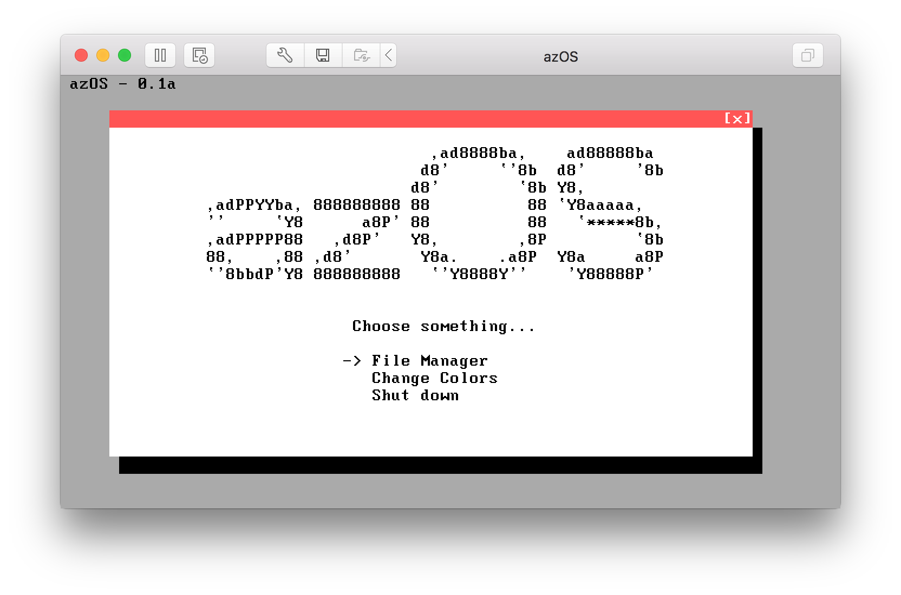

# azOS
**azOS** is a small hobby OS written entirely in [FASM assembly](https://flatassembler.net). It contains a bootloader and a simple GUI kernel which is able to run some old DOS applications or games. The main purpose of the project was to expand my knowledge in assembly language, FAT file system and interrupts handling.

## Running azOS
Running **azOS** is quite simple. Just grab the latest stable build – *build/azOS.img*. You can use https://dustinbrett.com/ – a website that emulates x86 images right in a browser.
Also you can connect the image file to a new virtual machine in VMWare, QEMU, VirtualBox or Bochs as a floppy disk and boot from it. 
Actually, you can run **azOS** on real hardware: write the image file to a real 3.5" floppy using WinImage, choose "Floppy Drive" option in your BIOS boot settings and have fun. Most probably you'll need a 30+ year old computer for that.

## Building azOS
Writing in FASM on macOS isn't comfortable at all, so you better have a computer with Windows or at least install a virtual machine. (I was using a MacBook and running my OS in Bochs on Windows XP in VMWare on macOS 😆, but I've tried it on a real hardware too)
###Prerequisites
* VMWare or QEMU
* First of all install [FASM compiler](https://flatassembler.net) and specify your path to it in *build.bat*.
* Install [WinImage](http://www.winimage.com). Compiler will generate a floppy image with the bootloader on it and the kernel file separate from each other so you need to copy the kernel on the floppy image by yourself.
* *(Optionally)* Install [ImDisk Toolkit](https://sourceforge.net/projects/imdisk-toolkit/) and you can use the *build.bat* script that will automatically copy all the necessary files in the floppy image.

When you're ready just run *build.bat* script and the image **azOS.img** will appear in *build* folder. Now you can run it as described before. If you are running Windows as a virtual machine on your Mac you may find useful the script *send_to_macos.bat* which simply copies fresh image to your User folder so you can run it in VMWare Fusion on macOS.

## Debugging azOS
Feel free to change the OS code. If you're having any trouble with it you should use a debugger to find bugs in the code. I personally use Bochs in debugger mode, because it allows to debug everything, including registers and BIOS interrupts and it has a nice Graphical User Interface. You can find the debug config named *dbg.bxrc* in this repo (win32 only, I guess).  

## Contact
Hi there. I'm Azarov Alexander, a computer science student from Minsk, Belarus, now living somewhere in Europe or Canada.  
You can contact me with any questions, feedback or just to ~~hire me~~ say hi, at alex@azarov.by. Speaking languages: English, Français, Русский.
